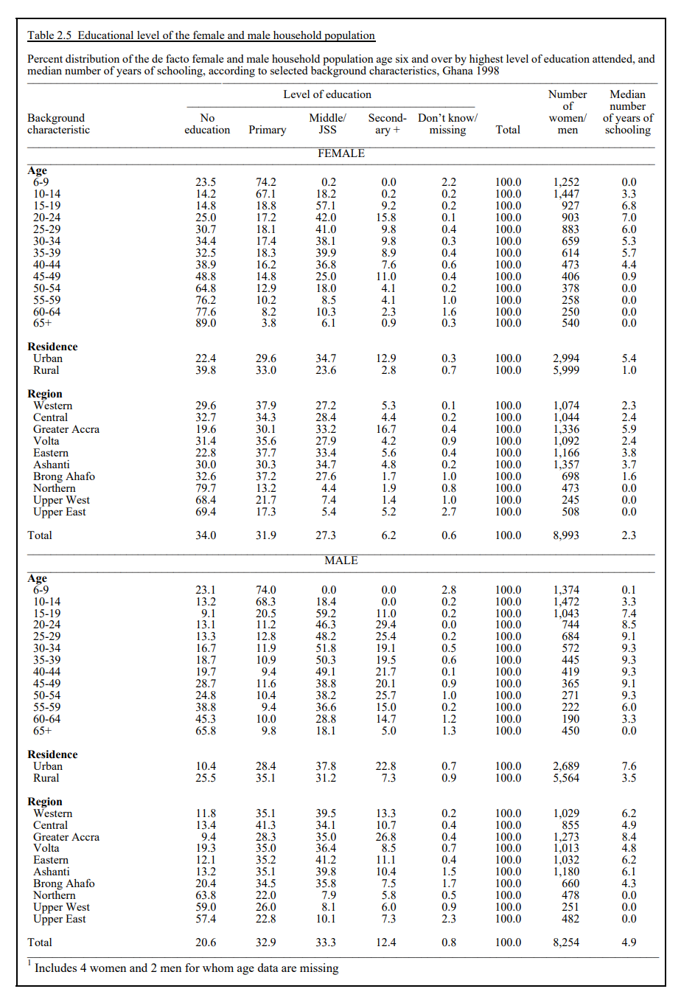

```{r setup, include=FALSE}
library(tidyverse)
library(broom)
library(ggplot2)
getwd()
reduced_data <-  read.csv("/home/jovyan/1STA304/starter_folder-main/inputs/data/reduced_data.csv")
```
\pagebreak

# Introduction

Education level is now one of the most important things in the world, which affects people's life, the development of society and the economic level of a country. In this report, we use data from DHS program(Demographic and Health Surveys) to analyze the relationship between education level, age and gender of People in Ghana in 1998. [@FR106] In this report the analysis tool we are using is R [@citeR].

In the data section of this report, there are four graphs about the age, sex and education level of Ghanaians in 1998. Which are people with no education, with primary school education, those with junior high school education, and those with high school education and above. From these four graphs we can see that there were more uneducated women than uneducated men at that time. Conversely, there are more men than women with higher education. This reflects that men in Ghana were generally more educated than women at that time. Secondly, we can see that in 1998, the educational level of the elderly in Ghana was generally low, while the educational level of young people was high. This shows that in Ghana in the early years, schooling was not popular.

In addition to our introduction, this report has a data [\@ref(data)] section below, which visually shows the relationship between Ghanaian education level, age and gender in 1998 from four stages. The following method [\@ref(method)] section analyzes the above problem with linear regression. Next, the result [\@ref(result)] section summarizes the findings of this report. The discussion [\@ref(discussion)] at the end discusses the findings of this article from a global perspective, expanding on it relationship to the world. It also describes the weakness of the data we used in this report, as well as methods for future improvements.


# Data

## Data Collection

This data is from the DHS final report which can be found on the DHS program website where DHS means the demographic and health surveys. This report is about Ghana which is a country in West Africa. The data was collected in 1998 in Ghana. The publication date is October 1999, and the publication ID is FR106, and it is the third this kind of survey in this country. This survey contains 17247 observations, 8993 of them are females, and 8254 are males. A total of 6375 households had been selected for this survey. There are 6055 households that were occupied, and 6033 households were interviewed. The table [\@ref(fig:tabl)] we used came from the Ghana demographic and health survey 1998, and it is from the 12th page of this report. Even though this report is more focused on the health of the people from Ghana, we are going to focus on the education level of this country. This dataset is unique and it takes a long time to collect.


## Data Characteristic

Before our analysis, we need to clean the dataset. The package tidyverse [@tidyverse] and dplyr [@dplyr] had been used here to clean the data. The original data looks like [Figure: \@ref(fig:tabl)], which is a summary table of the data this group got. As we can see, this table does not look that good, so we need to clean it up in order to make it nicer. First, we use the package pdftools [@pdftools] to get data from the report, then we selected the table on page 12 and change it into a table that we can use in R. Since we are focusing on the age group, hence we filtered out the region and residence. Next, we split the column and name them as the name given in the table in the final report. After this, we added a column named "Gender" to show if the data is from males or females. Since we are analyzing the education level, we filtered out the age group 6-9 since the kids at this age must be in primary school or do not go to school at all. Finally, we selected the data age, no education, primary, middle, secondary, number, and gender for our analysis. 

The table [\@ref(tab:var)] explains the variables' meaning. This dataset is the summary of the survey, which means the numerical variables are the percentage of the number of people in this age group, and the variable "Number" is the total number of people in this age group. This is one of the weaknesses of this data since we cannot really observe the original dataset, we only have a summary of the original dataset.


```{r tabl, fig.cap="Table from DHS Report.", echo=FALSE, warning = FALSE}



```


````{r var, echo=FALSE}
knitr::kable(
  data.frame(variable = c("age", "no_education", "Primary", "Middle", "Secondary", "Number", "Gender"),
             Meaning = c("Age group of the people", "The percentage of this age group of people that has no eductaion", "The percentage of this age group of people that went to primary school", "The percentage of this age group of people that went to middle school or JSS", "The percentage of this age group of people that went to secondary school or higher", "The total number of this age group", "The gender of this age group (male or female)")),
  caption = 'Variable Meaning')
```

## Data Relationship

Finding out the relationship between data is important for us to go on to the next step. Graphics is really great tool for us to get visualized. In order to draw graphs, the package ggplot2 [@ggplot2] had been used. In [Graph: \@ref(fig:sec)], the relationship between age and the percentage of people attending secondary school had been shown in this bar plot. As shown in the graph males are more likely to go to secondary education or more than females. Also, according to this graph, the younger age group is more likely to have higher education than the older age group. Especially in the group of 65+, most people do not attend a school that is higher than secondary school.

The next graph, [Graph: \@ref(fig:noed)], is the graph about age group vs. people who do not have any education. The graph is left-skewed, which means it is higher on the right side. Hence, people that are older are more likely to have no education. Females are more likely to not go to school than males. Then is the graph [Graph: \@ref(fig:pri)], The age group 10-14 has the most people that attend a primary school which is understandable. In this graph, we can tell that most of the people whose highest level of education is primary are women. Then is the graph for middle vs. age [\@ref(fig:mid)]. The age group of the people that have the highest degree is middle is the 15-19 years old which is match our common sense. For the people that are older the more males have the highest degree in middle school is more than females. 


```{r sec, fig.cap = "Difference in gender between each age group went to secondary school",echo=FALSE}
ggplot(reduced_data,aes(fill=Gender, x=age, y=Secondary)) + 
    geom_bar(position="stack", stat="identity")

```

```{r noed, fig.cap = "Difference in gender between each age group do not have any education",echo=FALSE}
ggplot(reduced_data,aes(fill=Gender, x=age, y=no_education)) + 
    geom_bar(position="stack", stat="identity")

```


```{r pri, fig.cap = "Difference in gender between each age group went to primary school",echo=FALSE}
ggplot(reduced_data,aes(fill=Gender, x=age, y=Primary)) + 
    geom_bar(position="stack", stat="identity")

```

```{r mid, fig.cap = "Difference in gender between each age group went to middle school",echo=FALSE}
ggplot(reduced_data,aes(fill=Gender, x=age, y=Middle)) + 
    geom_bar(position="stack", stat="identity")

```

## Methodology

A questionnaire had been used to collect data. Three types of the survey had been used here, the Household Questionnaire, the Women's Questionnaire, and the Men's Questionnaire. These questionnaires are based on the international MEASURE DHS+ program's survey model, which is used to provide the information
needed by the health and family planning programs. This questionnaire was developed in English and translated into the major local languages which include Akan, Ga, Ewe, Hausa, and Dagbani.

The Household Questionnaire is used to list all selected general members and visitors and gather information on household socioeconomic status. The Women's Questionnaire is used to collect topics about female health, such as reproductive history, contraceptive knowledge,  women’s work, knowledge of HIV/AIDS and STDs, etc... The Male's Questionnaire has topics about males that are similar to women's which include reproduction, contraceptive knowledge and use, marriage, knowledge of HIV/AIDS and STDs, etc...

In order to collect data, staff was trained for a really long time and spot checks were carried out while the lister was on site to ensure that the work was done correctly and completely. In some cases, listers were sent back to the relist areas where households were missed or incorrectly listed.

# Method

There are three variables in the dataset we selected: age, education level and gender. Now we would like to study about the relationship between these three variables. One relation to look at is gender-education, which can provide insights into whether males and females receive the same level of education in Ghana in 1998. The other one we want to analyze is the relationship between age and education level, since it can present a trend of education level changes over the past few decades in Ghana. Since the completion rate of lower secondary education (the ratio between the number of new entrants in the last grade of lower secondary education and the total population of the theoretical entrance age to the last grade of lower secondary) is 52.68% in Ghana in 1999[@e], it would be reasonable to consider secondary education and higher as a good representative of the general education level.

To find out how male and female differ in their education level, we decide to use a two sample hypothesis test. We will compare the average percentage of people who completed at least secondary education between males and females.

## Two sample HT

Firstly, we used the two sample Hypothesis is test of mean percentage of "Secondary+" between male and female. The Null Hypothesis in this case is $\mu_{male} = \mu_{female}$; it means the population average percentage of people that finished their secondary or higher education for males is the same as females. The Alternative Hypothesis is  $\mu_{male} > \mu_{female}$, which means the population average percentage of people that finished their secondary or higher education for males is higher than females. 

## Linear regression model

$$Y_i = \beta_1 X_{i,1} + \beta_2 X_{i,A}+\epsilon_i,$$
$i=1,\ldots,n$ where $n$ is the number of age groups in the sample.
$Y_i$ is the population percentage of secondary+ education for the $i^{th}$ age group\
$X_{i,1}$ is the midpoint age for the $i^{th}$ age group
$X_{i,A}$ is the population percentage difference between the $i^{th}$ age group among males and females. It equals to 1 if it is the $i^{th}$ age group for males. It equals to 0 if it is the $i^{th}$ age group for females.

$\beta_1$ meaning:
when $X_{i,1}$ increase by one unit, the expected value of $Y_i$ changes by $\beta_1$ for both males and females age groups.

$\beta_2$ meaning:\
the difference in expected value of $Y_i$ between male and female age group.

$\epsilon_i$ is the $i^{th}$ error term for this regression model.


```{r, include = FALSE}

rd <- reduced_data

t <- t.test(rd$Secondary[rd$Gender == "Male"], rd$Secondary[rd$Gender == "Female"], 
            alternative = "two.sided", var.equal = FALSE)

#or
male<- rd %>% filter(Gender == "Male") %>% select(Secondary) 
female<- rd %>% filter(Gender == "Female") %>% select(Secondary) 
t <- t.test(male$Secondary, female$Secondary, 
            alternative = "two.sided", var.equal = FALSE)
t # hide this result


selectedData <- rd[-c(1,12,13,24),]
selectedData$age <- rowMeans(matrix(as.numeric(unlist(stringr::str_extract_all(selectedData$age, pattern = "[:digit:]{1,2}"))), ncol = 2, byrow = T))
mod <- lm(Secondary ~ age + Gender, data = selectedData)
summary(mod)$coefficient
knitr::kable(tidy(mod), caption = "ABC")

selectedData %>% ggplot(aes(x=age, y=Secondary, color=Gender)) + 
  geom_point(alpha=0.5) +
  geom_smooth(formula = y ~ x, method="lm", se=FALSE)

```


# Result

We found the test statistic for two sample t test (unequal variance) is `r t$statistic`, the corresponding p-value of `r t$p.value` means we have statistically sufficient evidence to reject our Null Hypothesis. In other words, males and females in the dataset do not have the same level of secondary+ education, in fact, the average population percentage of men is significantly higher than women. 

Based on observation [\@ref(fig:linear)], there might be a negative correlation between age and secondary+ education level. Therefore, we would like to examine our observation using a linear regression model of age and population percentage of secondary and higher education. As you can find linear regression coefficient table in [Table: \@ref(tab:res)].

As the age of people increases by one year, the population percentage of people who completed their secondary or higher education decreases by 0.14%. In addition, the population percentage of males that receive secondary or higher education is 11.9% higher than females on average.

From the data analysis above, our major findings can be summarized in two points. One is that males in Ghana in 1998 have higher education level than females, and the other is that people who are older receive lower education in Ghana in 1998. We will discuss about these further in the discussion 

````{r res, echo=FALSE}
knitr::kable(tidy(mod), caption = "linear regression coefficient table")

```


```{r linear, fig.cap = "Linear Regression Graph",echo=FALSE}
selectedData %>% ggplot(aes(x=age, y=Secondary, color=Gender)) + 
  geom_point(alpha=0.5) +
  geom_smooth(formula = y ~ x, method="lm", se=FALSE)
```

# Discussion

## About this report

The first important point we found in this report is that men are generally more educated than women. In this report, we divide the education level into four levels, no education, primary school education, middle school education, secondary school education and above. 

For the bar plot of age, gender and uneducated people, with pink represent women and blue represent men. We can see that, in basically all age groups, the proportion of women who have no education is far greater than that of men. Especially for older people, women make up about two-thirds of the total population without education. As can be seen from the bar plot of age, gender and primary education, women still take more proportion than men in almost all age groups. However, the difference between the number of males and females is not very large in this plot. The next two graphs have completely opposite results to the two graphs we have analyzed above. As can be seen from the chart of secondary school education, the proportion of men in all age groups has begun to be larger than of women, especially the proportion of men over the age of 40, which is almost reach three or four times that of women. In the graph of high school education and above, we can see that in all age groups, the proportion of males is larger than that of females, and even in each age group, the number of males can reach two or three times that of females.

Among the highly educated people, the proportion of men is much higher than that of women, and conversely, among the uneducated people, the proportion of women is much larger than that of men. This comparison shows that around 1998, men were much more educated than women.

The second important point we found in this report is that older people are much less educated than younger people. In the uneducated graph, there is a clear upward trend in age and the number of uneducated. Conversely, among those with primary school education, middle school education, and high school education and above, the proportion of older people becomes smaller and smaller. This shows that in 1998, the education level of the elderly in Ghana was generally low, and the number of educated young people was increasing.

## Connection to the world

First of all, this report reflects the traditional society's idea that men should be receive education and women stay at home without education. From the data section, we can see that men are much more educated than women, and we find relevant data showing that in 1989-1990 government statistics showed that schools continued to enroll more men than women. In primary education, only 45% of students are girls. The proportion of women in school drops to 33% at the secondary level, 27% at technical colleges and 19% at university. In the society of the 19th century, the traditional idea in that social were that men were educated and then earned money to support their families, and women were responsible for housework and reproduction.[@a] 

However, in our modern society, most countries have achieved gender parity in primary school enrolments, but in many countries, girls are still in an unfair position. In recent years, many countries have made considerable progress in achieving universal primary education and closing the gender gap in enrolments. More than two-thirds of countries have achieved gender parity, but there are also some that have not fully achieved it, especially in Africa, the Middle East and South Asia, where girls are more likely than boys to be disadvantaged.[@b] However, with the progress of the times, the ratio of male and female enrollment has gradually balanced, indicating that people's ideas in the old society are gradually changing, and the status of men and women in society is gradually keep in a balance. Even in many countries, there are more women with higher education than men, which is a good thing in today's society.

At the same time, the report reflects that the education level of society in the nineteenth century was very low, and those born in the early years were not educated. We can also see a slow rise in education levels in the nineteenth century in the data section of our report. After decades of development, the level of low education around the world has improved, and more and more people have been educated from an early age, starting school and further education.


According to some data, at the end of the twentieth century, the global public education expenditure was more than 10 billion US dollars. Public education expenditure is the main indicator to measure the capital investment in education. Most of countries education funding structures are dominated by public funds and supplemented by private funds. This investment reflects the investment in education in many countries in recent decades. At the same time, at the end of the twentieth century, the net enrolments rate in primary schools was over 95%. The popularization of primary education can ensure that citizens have basic abilities, ensure the minimum level of education, and promote national economic development and democratic construction. Also, the secondary school net enrollments rate is over 90%. The popularization of secondary education is one of the basic requirements of educational modernization. The college net enrollment rate is also above 30%. The university enrollment rate reflects the degree of popularization of higher education. [@c]

Therefore, we can see that both the balance of male and female enrollment ratios, and the educational level of the people, are much better today than they were in the 19th century. As long as the global trend is getting better and better, the education level of people in each country will also become higher and higher.


## Weakness and the next steps

The set of data we analyses in the report also have some weakness. There are two main point we could improve in our further report. 

First of all, the data we analyses in this report is the summarized data, not the original data set. Which means all the data we see is they have been cleaned and filtered. Although it makes our work more efficient, we cannot see the details about the original data, which may cause some small deviations in the data we analyze. If in future analysis, except for the cleaned data, it is better to use the original data set as a reference to see what details need to be modified.

Secondly, this set of data was collected in 1998. In 1998, the questionnaire was first published in English. Since many people cannot speak English at that time, the official translated the questionnaire from English into many local languages which includes Akan, Ga, Ewe, Hausa, and Dagbani. There may be some small deviations in the translation process. At the same time, from the above analysis, we can see that many Ghanaians did not have much education when writing this questionnaire, so it they are likely to have misunderstandings or dyslexia when completing the questionnaire, which also leads to our analysis results may be biased. This is an unavoidable disadvantage due to the data collected two decades ago.

## Suggestion based on the result

Based on our analysis above, there are some suggestions for people all over the world. We encourage people of all ages in every country receive education. First of all, receiving education can change people's thinking and it can also avoid some misunderstandings of children in an early age. This will also be good for the society, which will make the whole society more harmonious.  Also, being educated can create more employment opportunities. A good educational background will help people to find a better job, is the most direct way to improve the life. Moreover, receiving education can also help a country to improve the economy. Higher educational background can help people get better job and been well paid. It increase the GDP of a country and decrease the poverty rate at the same time.[@d]


\newpage

\appendix

# Appendix {-}


# Additional details

**Motivation**

1. *For what purpose was the dataset created? Was there a specific task in mind? Was there a specific gap that needed to be filled? Please provide a description.*
    - The dataset was created to collect data on fertility, family planning, and maternal and child health.
2. *Who created the dataset (for example, which team, research group) and on behalf of which entity (for example, company, institution, organization)?*
    - The Ghana Statistical Service created the dataset.
3. *Who funded the creation of the dataset? If there is an associated grant, please provide the name of the grantor and the grant name and number.*
    - The funded the creation of dataset is United Nations Fund for Population Activities (UNFPA), the United States Agency for International Development (USAID), and other donor agencies to implement a number of population-related activities.
4. *Any other comments?*
    - No.

**Composition**

1. *What do the instances that comprise the dataset represent (for example, documents, photos, people, countries)? Are there multiple types of instances (for example, movies, users, and ratings; people and interactions between them; nodes and edges)? Please provide a description.*
 - The instances represent Ghana. The types are: Western, Central, Greater Accra, Volta, Eastern, Ashanti, Brong Ahafo, Northern, Upper West, and Upper East, corresponding to different regions of the country.
2. *How many instances are there in total (of each type, if appropriate)?*
 - There are no data show the number of instances.
3. *Does the dataset contain all possible instances or is it a sample (not necessarily random) of instances from a larger set? If the dataset is a sample, then what is the larger set? Is the sample representative of the larger set (for example, geographic coverage)? If so, please describe how this representativeness was validated/verified. If it is not representative of the larger set, please describe why not (for example, to cover a more diverse range of instances, because instances were withheld or unavailable).*
 - The dataset does contain all possible instances.
4. *What data does each instance consist of? "Raw" data (for example, unprocessed text or images) or features? In either case, please provide a description.*
 - Each instance consists of 5 variables: gender, age, residence, region and education level.
5. *Is there a label or target associated with each instance? If so, please provide a description.*
 - No.
6. *Is any information missing from individual instances? If so, please provide a description, explaining why this information is missing (for example, because it was unavailable). This does not include intentionally removed information, but might include, for example, redacted text.*
 - No.
7. *Are relationships between individual instances made explicit (for example, users' movie ratings, social network links)? If so, please describe how these relationships are made explicit.*
 - There are no relationships between individual instances.
8. *Are there recommended data splits (for example, training, development/validation, testing)? If so, please provide a description of these splits, explaining the rationale behind them.*
 - There are no recommended data splits.
9. *Are there any errors, sources of noise, or redundancies in the dataset? If so, please provide a description.*
 - There are no errors, sources of noise, or redundancies in the dataset.
10. *Is the dataset self-contained, or does it link to or otherwise rely on external resources (for example, websites, tweets, other datasets)? If it links to or relies on external resources, a) are there guarantees that they will exist, and remain constant, over time; b) are there official archival versions of the complete dataset (that is, including the external resources as they existed at the time the dataset was created); c) are there any restrictions (for example, licenses, fees) associated with any of the external resources that might apply to a dataset consumer? Please provide descriptions of all external resources and any restrictions associated with them, as well as links or other access points, as appropriate.*
 - The dataset is self-contained.
11. *Does the dataset contain data that might be considered confidential (for example, data that is protected by legal privilege or by doctor-patient confidentiality, data that includes the content of individuals' non-public communications)? If so, please provide a description.*
 - There is no confidential data, and the dataset is available to public.
12. *Does the dataset contain data that, if viewed directly, might be offensive, insulting, threatening, or might otherwise cause anxiety? If so, please describe why.*
 - In Table 2.4, the word "Father dead" and "Mother dead" might be offensive because the word "dead" might remind people who lost their parents in a negative way.
13. *Does the dataset identify any sub-populations (for example, by age, gender)? If so, please describe how these subpopulations are identified and provide a description of their respective distributions within the dataset.*
 - The survey was designed to obtain completed interviews of 4,500 women age 15-49. In addition, all males age 15-59 in every third selected household were interviewed, to obtain a target of 1,500 men.
14. *Is it possible to identify individuals (that is, one or more natural persons), either directly or indirectly (that is, in combination with other data) from the dataset? If so, please describe how.*
 - It is not possible to identify individuals in any way.
15. *Does the dataset contain data that might be considered sensitive in any way (for example, data that reveals race or ethnic origins, sexual orientations, religious beliefs, political opinions or union memberships, or locations; financial or health data; biometric or genetic data; forms of government identification, such as social security numbers; criminal history)? If so, please provide a description.*
 - Sensitive columns may include but not limited to: "Father dead", "Mother dead" and "Both dead".
16. *Any other comments?*
 - None.

**Collection process**

1. *How was the data associated with each instance acquired? Was the data directly observable (for example, raw text, movie ratings), reported by subjects (for example, survey responses), or indirectly inferred/derived from other data (for example, part-of-speech tags, model-based guesses for age or language)? If the data was reported by subjects or indirectly inferred/derived from other data, was the data validated/verified? If so, please describe how.*
 - These data were acquired from survey responses,, the data were validated since if there are any mistakes workers will come back and get them again.
2. *What mechanisms or procedures were used to collect the data (for example, hardware apparatuses or sensors, manual human curation, software programs, software APIs)? How were these mechanisms or procedures validated?*
 - Manual human curation had been used.
3. *If the dataset is a sample from a larger set, what was the sampling strategy (for example, deterministic, probabilistic with specific sampling probabilities)?*
 - The sample was randomly selected from households.
4. *Who was involved in the data collection process (for example, students, crowdworkers, contractors) and how were they compensated (for example, how much were crowdworkers paid)?*
 - There are a lot of workers that had involved in data collection, they got paid and trained by the government.
5. *Over what timeframe was the data collected? Does this timeframe match the creation timeframe of the data associated with the instances (for example, recent crawl of old news articles)? If not, please describe the timeframe in which the data associated with the instances was created.*
 - Household listing began in August and lasted for about two months. 
6. *Were any ethical review processes conducted (for example, by an institutional review board)? If so, please provide a description of these review processes, including the outcomes, as well as a link or other access point to any supporting documentation.*
 - Not sure.
7. *Did you collect the data from the individuals in question directly, or obtain it via third parties or other sources (for example, websites)?*
 - I collect the data from the DHS project website.
8. *Were the individuals in question notified about the data collection? If so, please describe (or show with screenshots or other information) how notice was provided, and provide a link or other access point to, or otherwise reproduce, the exact language of the notification itself.*
 - The individuals voluntarily participated in the interview with data collectors. Also, the notice of data collection is not provided.
9. *Did the individuals in question consent to the collection and use of their data? If so, please describe (or show with screenshots or other information) how consent was requested and provided, and provide a link or other access point to, or otherwise reproduce, the exact language to which the individuals consented.*
 - The individuals consented to the collection and use of their data, however, the exact language to which the individuals consented is not available.
10. *If consent was obtained, were the consenting individuals provided with a mechanism to revoke their consent in the future or for certain uses? If so, please provide a description, as well as a link or other access point to the mechanism (if appropriate).*
 - A mechanism to revoke consent was not provided.
11. *Has an analysis of the potential impact of the dataset and its use on data subjects (for example, a data protection impact analysis) been conducted? If so, please provide a description of this analysis, including the outcomes, as well as a link or other access point to any supporting documentation.*
 - An analysis of the potential impact of the dataset and its use on data subjects was not conducted.
12. *Any other comments?*
 - None.

**Preprocessing/cleaning/labeling**

1. *Was any preprocessing/cleaning/labeling of the data done (for example, discretization or bucketing, tokenization, part-of-speech tagging, SIFT feature extraction, removal of instances, processing of missing values)? If so, please provide a description. If not, you may skip the remaining questions in this section.*
 - The data was obtained in PDF format originally. A summary table on page 12 from the survey PDF was converted to a useable data frame in R using the library pdftools.
2. *Was the "raw" data saved in addition to the preprocessed/cleaned/labeled data (for example, to support unanticipated future uses)? If so, please provide a link or other access point to the "raw" data.*
 - The raw data obtained from the PDF is saved in inputs/data/raw_data.csv
3. *Is the software that was used to preprocess/clean/label the data available? If so, please provide a link or other access point.*
 - R software is available at https://www.R-project.org/
4. *Any other comments?*
 - The library used to convert data from PDF is available at https://docs.ropensci.org/pdftools/

**Uses**

1. *Has the dataset been used for any tasks already? If so, please provide a description.*
 - The dataset has not been used for other tasks yet.
2. *Is there a repository that links to any or all papers or systems that use the dataset? If so, please provide a link or other access point.*
 - http://dhsprogram.com/pubs/pdf/FR106/FR106.pdf
3. *What (other) tasks could the dataset be used for?*
 - The dataset can be used for analyzing educational level among all male and female age groups in Ghana in 1998.
4. *Is there anything about the composition of the dataset or the way it was collected and preprocessed/cleaned/labeled that might impact future uses? For example, is there anything that a dataset consumer might need to know to avoid uses that could result in unfair treatment of individuals or groups (for example, stereotyping, quality of service issues) or other risks or harms (for example, legal risks, financial harms)? If so, please provide a description. Is there anything a dataset consumer could do to mitigate these risks or harms?*
 - The cleaning process is very specific to consider how this table was formatted, in which case it might not work on other tables.
5. *Are there tasks for which the dataset should not be used? If so, please provide a description.*
 - The dataset would not be appropriate for purposes other than studying the educational level in 1998 Ghana.
6. *Any other comments?*
 - None.

**Distribution**

1. *Will the dataset be distributed to third parties outside of the entity (for example, company, institution, organization) on behalf of which the dataset was created? If so, please provide a description.*
 - No, the dataset is available to public and being used for personal uses only.
2. *How will the dataset be distributed (for example, tarball on website, API, GitHub)? Does the dataset have a digital object identifier (DOI)?*
 - The dataset will be distributed using Github.
3. *When will the dataset be distributed?*
 - The dataset wwill be distributed in April 2022.
4. *Will the dataset be distributed under a copyright or other intellectual property (IP) license, and/or under applicable terms of use (ToU)? If so, please describe this license and/ or ToU, and provide a link or other access point to, or otherwise reproduce, any relevant licensing terms or ToU, as well as any fees associated with these restrictions.*
 - The dataset will be released under MIT license.
5. *Have any third parties imposed IP-based or other restrictions on the data associated with the instances? If so, please describe these restrictions, and provide a link or other access point to, or otherwise reproduce, any relevant licensing terms, as well as any fees associated with these restrictions.*
 - There are no restrictions.
6. *Do any export controls or other regulatory restrictions apply to the dataset or to individual instances? If so, please describe these restrictions, and provide a link or other access point to, or otherwise reproduce, any supporting documentation.*
 - No such controls are applicable.
7. *Any other comments?*
 - None.

**Maintenance**

1. *Who will be supporting/hosting/maintaining the dataset?*
 - Ghana Statistical Service hosting the dataset.
2. *How can the owner/curator/manager of the dataset be contacted (for example, email address)?*
 - Can be contacted via github.
3. *Is there an erratum? If so, please provide a link or other access point.*
 - There is no currently available erratum.
4. *Will the dataset be updated (for example, to correct labeling errors, add new instances, delete instances)? If so, please describe how often, by whom, and how updates will be communicated to dataset consumers (for example, mailing list, GitHub)?*
 - There is no plan to update the dataset.
5. *If the dataset relates to people, are there applicable limits on the retention of the data associated with the instances (for example, were the individuals in question told that their data would be retained for a fixed period of time and then deleted)? If so, please describe these limits and explain how they will be enforced.*
 - There are no applicable limits as people in Ghana voluntarily participate.
6. *Will older versions of the dataset continue to be supported/hosted/maintained? If so, please describe how. If not, please describe how its obsolescence will be communicated to dataset consumers.*
 - The older versions will not be supported. Dataset consumers could check the updates through github commit history.
7. *If others want to extend/augment/build on/contribute to the dataset, is there a mechanism for them to do so? If so, please provide a description. Will these contributions be validated/verified? If so, please describe how. If not, why not? Is there a process for communicating/distributing these contributions to dataset consumers? If so, please provide a description.*
 - Currently there is no mechanism for accepting other contributions.
8. *Any other comments?*
 - None.

\newpage


# References


